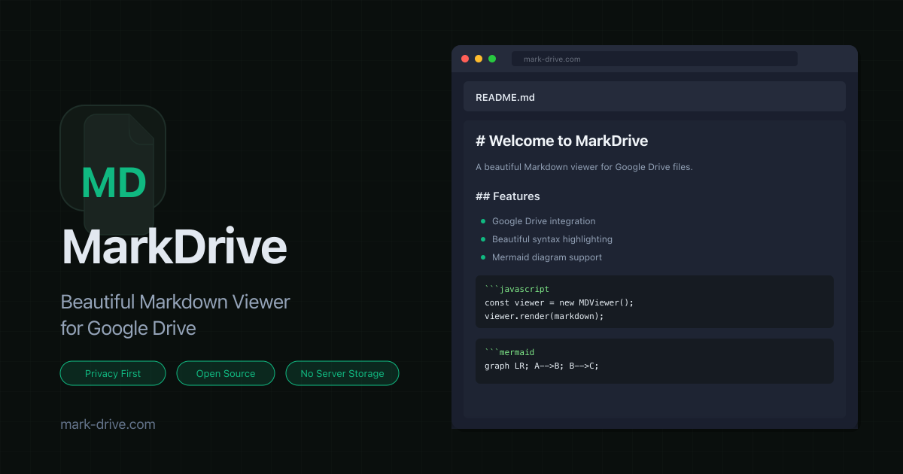

# MarkDrive

<a href="https://mark-drive.com/">
  
</a>

**Google Drive™ の Markdown をブラウザで美しくプレビュー・編集。サーバーにデータは一切保存しません。**

[mark-drive.com](https://mark-drive.com/)

[](https://buymeacoffee.com/luckypool)

<br />

## クイックスタート

```bash
bun install
bun run dev
```

http://localhost:8081 を開いて使えます。

> Google Drive 連携には API キーの設定が必要です。 [セットアップガイド](./docs/setup.md)

<br />

## ドキュメント

| | |
|---|---|
| [なぜ MarkDrive か](./docs/why.md) | 解決する課題と提供する価値 |
| [セットアップ](./docs/setup.md) | Google Cloud Console の設定方法 |
| [アーキテクチャ](./docs/architecture.md) | システム構成と技術スタック |
| [機能仕様](./docs/features.md) | 各機能の詳細仕様 |
| [開発ガイド](./docs/development.md) | 開発環境・テスト・デプロイ |
| [プライバシー](./docs/privacy.md) | プライバシーとセキュリティ |

<br />

## コントリビュート

[CONTRIBUTING.md](./CONTRIBUTING.md) を参照してください。

---

> Google Drive™ is a trademark of Google LLC.
