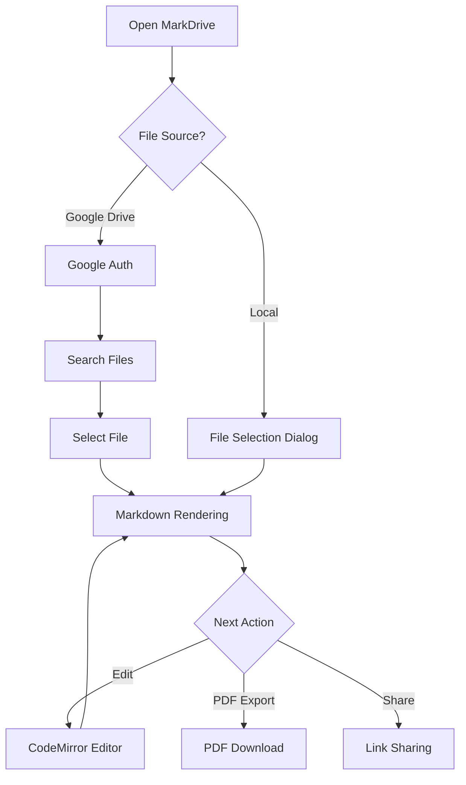
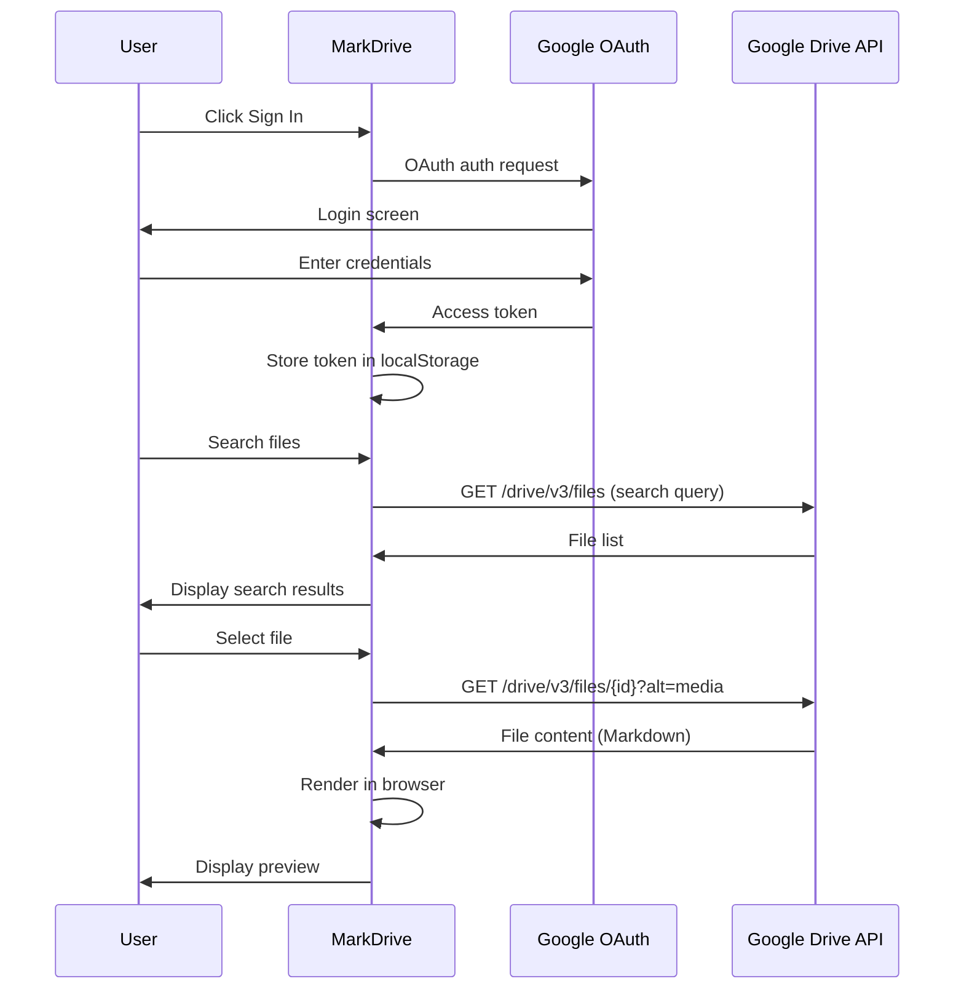
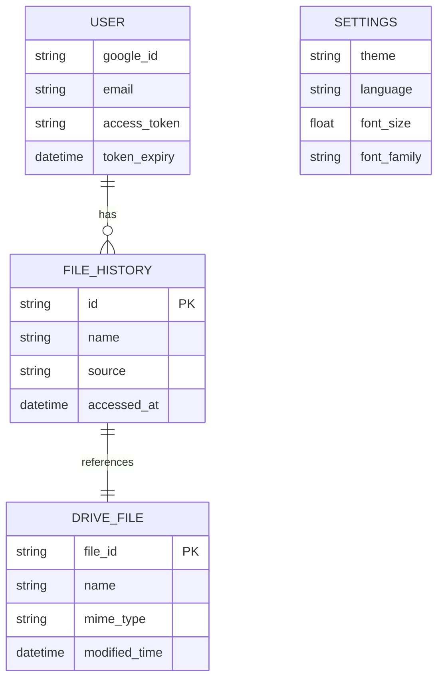
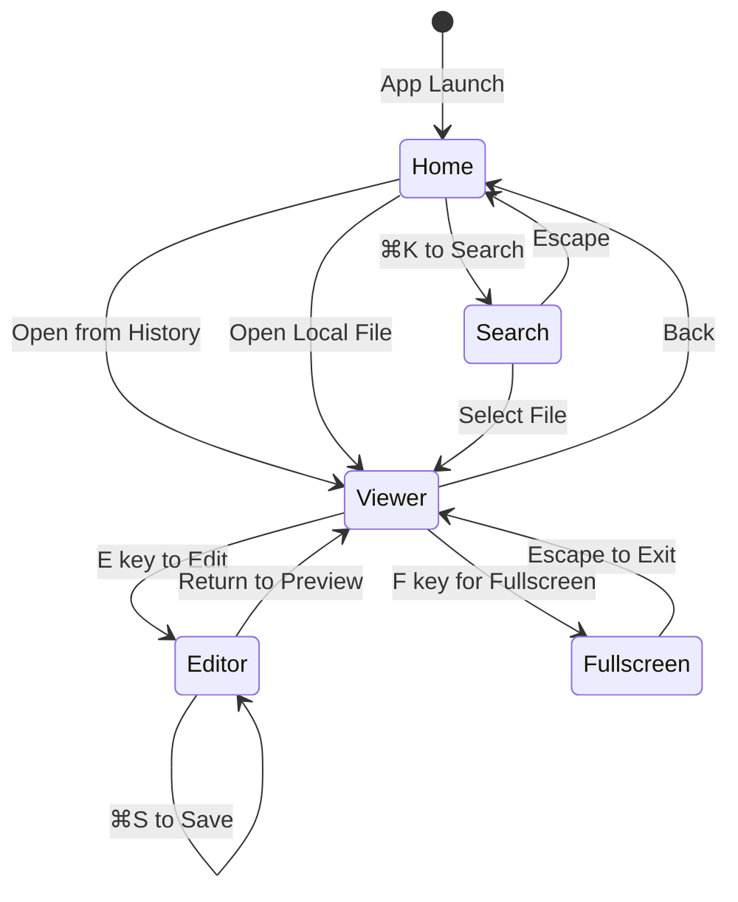
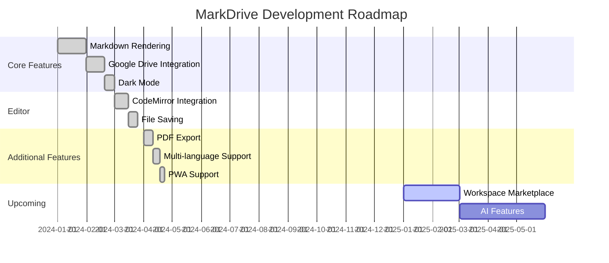
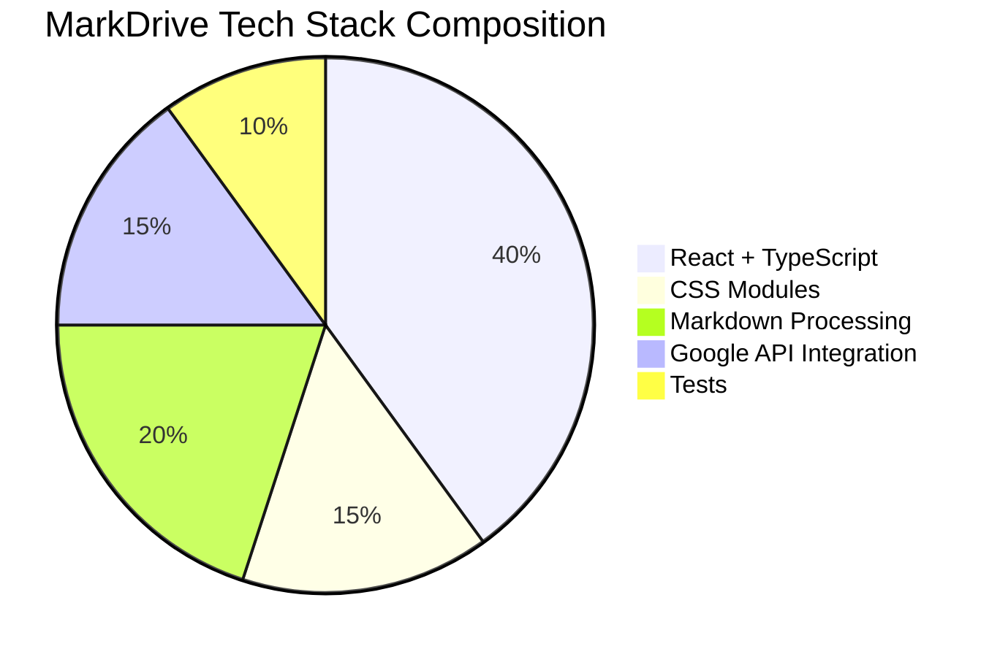
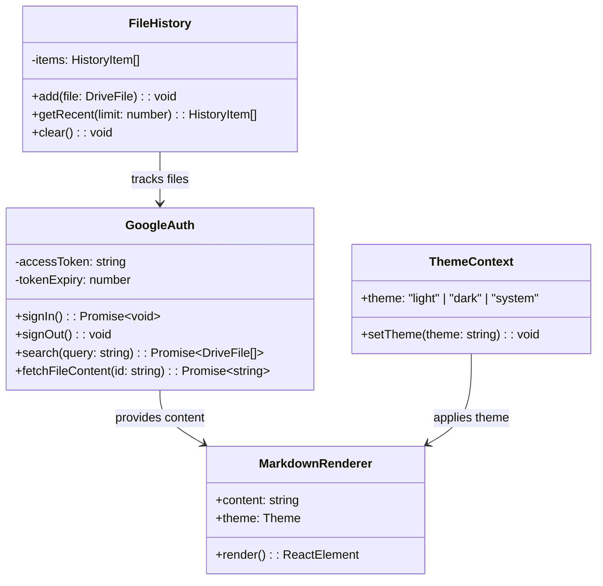

# MarkDrive Sample Document

This is a sample file to experience all the features of MarkDrive. Upload this file to Google Drive or open it as a local file.

---

## Basic Markdown

### Text Formatting

This is **bold** text. This is *italic*. You can also use ***bold italic***.

Inline `code` is wrapped with backticks.

> Blockquotes are displayed like this.
> They can span multiple lines.
>
> > Nested blockquotes are also supported.

---

## GFM (GitHub Flavored Markdown)

### Tables

| Feature | Status | Notes |
|---------|:------:|-------|
| GFM Tables | ✅ | Left, center, and right alignment |
| Task Lists | ✅ | Checkbox display |
| Syntax Highlighting | ✅ | Many languages supported |
| Mermaid | ✅ | Diagram rendering |
| KaTeX Math | ✅ | Inline and block support |
| PDF Export | ✅ | A4 size |

### Task Lists

- [x] Access MarkDrive
- [x] Sign in with Google account
- [x] Open a sample file
- [ ] Try dark mode
- [ ] Try PDF export
- [ ] Try edit mode

### Strikethrough

~~This feature has been deprecated~~ → Migrated to the new API

### Autolinks

https://mark-drive.com/

---

## Syntax Highlighting

### JavaScript

```javascript
async function fetchMarkdown(fileId) {
  const response = await fetch(
    `https://www.googleapis.com/drive/v3/files/${fileId}?alt=media`,
    { headers: { Authorization: `Bearer ${token}` } }
  );
  const text = await response.text();
  return text;
}
```

### TypeScript

```typescript
interface FileHistory {
  id: string;
  name: string;
  source: "google-drive" | "local";
  accessedAt: Date;
}

const getRecentFiles = (limit: number = 10): FileHistory[] => {
  const raw = localStorage.getItem("markdrive-file-history");
  if (!raw) return [];
  return JSON.parse(raw).slice(0, limit);
};
```

### Python

```python
def fibonacci(n: int) -> list[int]:
    """Generate the Fibonacci sequence"""
    if n <= 0:
        return []
    sequence = [0, 1]
    while len(sequence) < n:
        sequence.append(sequence[-1] + sequence[-2])
    return sequence[:n]

print(fibonacci(10))
# [0, 1, 1, 2, 3, 5, 8, 13, 21, 34]
```

### Go

```go
package main

import (
    "fmt"
    "net/http"
)

func handler(w http.ResponseWriter, r *http.Request) {
    fmt.Fprintf(w, "Hello, MarkDrive!")
}

func main() {
    http.HandleFunc("/", handler)
    http.ListenAndServe(":8080", nil)
}
```

### Rust

```rust
fn main() {
    let languages = vec!["Rust", "Go", "TypeScript", "Python"];

    let result: Vec<String> = languages
        .iter()
        .filter(|lang| lang.len() > 3)
        .map(|lang| format!("{} is great!", lang))
        .collect();

    for msg in &result {
        println!("{}", msg);
    }
}
```

### HTML / CSS

```html
<div class="markdown-body" data-theme="dark">
  <h1>MarkDrive</h1>
  <p>Beautiful Markdown for Google Drive</p>
</div>
```

```css
.markdown-body {
  --accent: #6366f1;
  font-family: -apple-system, BlinkMacSystemFont, "Segoe UI", sans-serif;
  line-height: 1.6;
  max-width: 800px;
  margin: 0 auto;
}

.markdown-body[data-theme="dark"] {
  background: #1a1a2e;
  color: #e0e0e0;
}
```

### JSON

```json
{
  "name": "mark-drive",
  "version": "1.0.0",
  "description": "Beautiful Markdown viewer for Google Drive",
  "scripts": {
    "dev": "vite",
    "build": "tsc && vite build",
    "preview": "vite preview"
  }
}
```

### YAML

```yaml
name: Deploy to Vercel
on:
  push:
    branches: [main]
jobs:
  deploy:
    runs-on: ubuntu-latest
    steps:
      - uses: actions/checkout@v4
      - uses: oven-sh/setup-bun@v2
      - run: bun install
      - run: bun run build
```

### Shell

```bash
#!/bin/bash
echo "Setting up MarkDrive..."
git clone https://github.com/luckypool/mark-drive.git
cd mark-drive
bun install
cp .env.example .env
echo "Edit .env with your Google API keys"
bun run dev
```

### SQL

```sql
SELECT
    files.name,
    files.mime_type,
    files.modified_time,
    owners.email AS owner
FROM drive_files AS files
JOIN file_owners AS owners ON files.id = owners.file_id
WHERE files.mime_type = 'text/markdown'
ORDER BY files.modified_time DESC
LIMIT 20;
```

---

## Mermaid Diagrams

### Flowchart



### Sequence Diagram



### ER Diagram



### State Diagram



### Gantt Chart



### Pie Chart



### Class Diagram



---

## Math Equations (KaTeX)

### Inline Math

Einstein's famous equation $E = mc^2$ expresses the equivalence of mass and energy. The area of a circle is given by $A = \pi r^2$, and the quadratic formula is $x = \frac{-b \pm \sqrt{b^2 - 4ac}}{2a}$.

### Block Math

Gaussian integral:

$$
\int_{-\infty}^{\infty} e^{-x^2} \, dx = \sqrt{\pi}
$$

Summation formula:

$$
\sum_{i=1}^{n} i = \frac{n(n+1)}{2}
$$

Euler's identity:

$$
e^{i\pi} + 1 = 0
$$

Taylor expansion:

$$
f(x) = \sum_{n=0}^{\infty} \frac{f^{(n)}(a)}{n!}(x - a)^n
$$

Matrix:

$$
A = \begin{pmatrix} a_{11} & a_{12} & \cdots & a_{1n} \\ a_{21} & a_{22} & \cdots & a_{2n} \\ \vdots & \vdots & \ddots & \vdots \\ a_{m1} & a_{m2} & \cdots & a_{mn} \end{pmatrix}
$$

Navier–Stokes equation:

$$
\frac{\partial \mathbf{u}}{\partial t} + (\mathbf{u} \cdot \nabla)\mathbf{u} = -\frac{1}{\rho}\nabla p + \nu \nabla^2 \mathbf{u} + \mathbf{f}
$$

---

## Other Markdown Elements

### Links

- [MarkDrive Official Site](https://mark-drive.com/)
- [GitHub Repository](https://github.com/luckypool/mark-drive)

### Images (Placeholder)

Images are displayed using standard Markdown syntax:

```markdown

```

### Horizontal Rule

A horizontal rule separating sections:

---

### Lists

#### Unordered List

- MarkDrive Features
  - Privacy First
    - Serverless architecture
    - File content processed in-browser
  - Beautiful Rendering
    - Syntax highlighting
    - Mermaid diagrams
  - Google Drive Integration

#### Ordered List

1. Sign in to Google Drive
2. Search for Markdown files
3. Select a file to preview
4. Edit if needed
5. Export as PDF or share

### Supplementary Notes

Additional information can be expressed using blockquotes:

> **💡 Tip:** Press `⌘K` (Mac) or `Ctrl+K` (Windows) to open the search screen from anywhere.

> **⚠️ Note:** Edits to Google Drive files are not written back to Drive. They are saved as downloads.

---

## Long Text Rendering Check

MarkDrive is a Markdown viewer designed with privacy as its top priority. It beautifully renders `.md` files stored in Google Drive directly in your browser, supporting all the features needed for technical documentation, including syntax highlighting and Mermaid diagrams. File content is sent directly from Google Drive to your browser—no intermediate servers are involved. This ensures that even documents containing confidential information can be viewed with confidence.

The edit mode, powered by CodeMirror 6, provides features such as Markdown syntax highlighting, line numbers, and in-editor search. Local files can be saved directly using the File System Access API in supported browsers. With three theme modes—dark, light, and system-following—plus multi-language support for English and Japanese, and customizable font size and typeface, MarkDrive delivers a comfortable reading experience.

---

*This sample document was created for testing the features of [MarkDrive](https://mark-drive.com/).*
