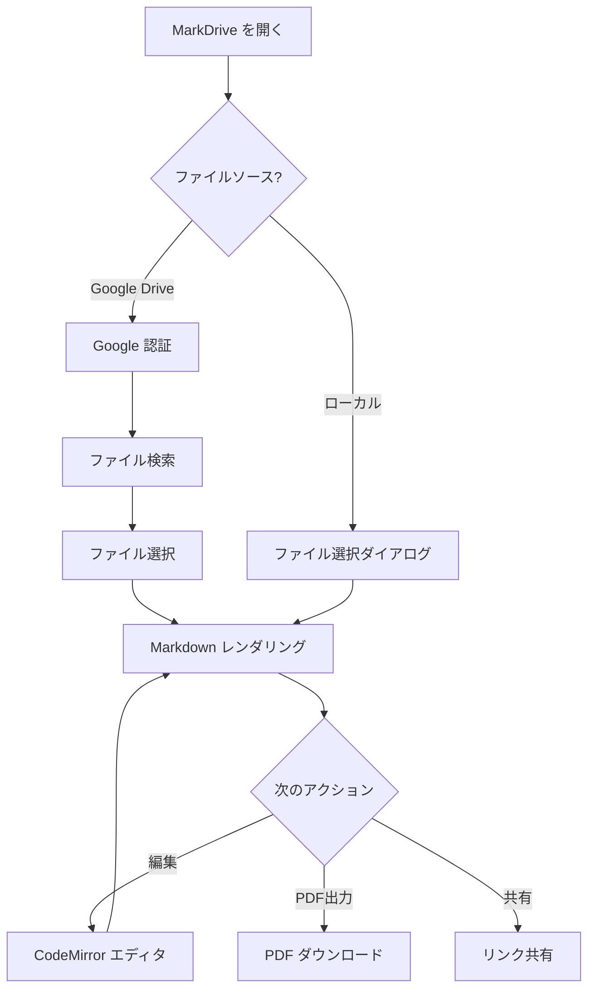
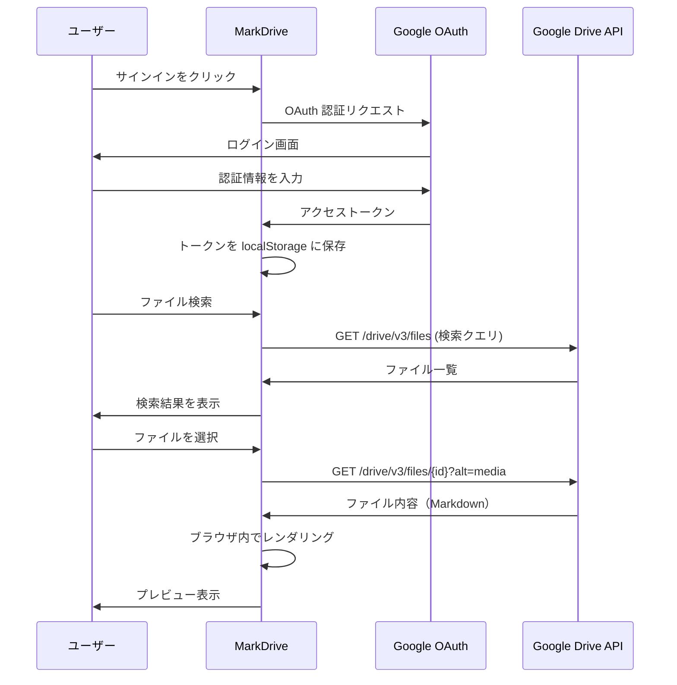
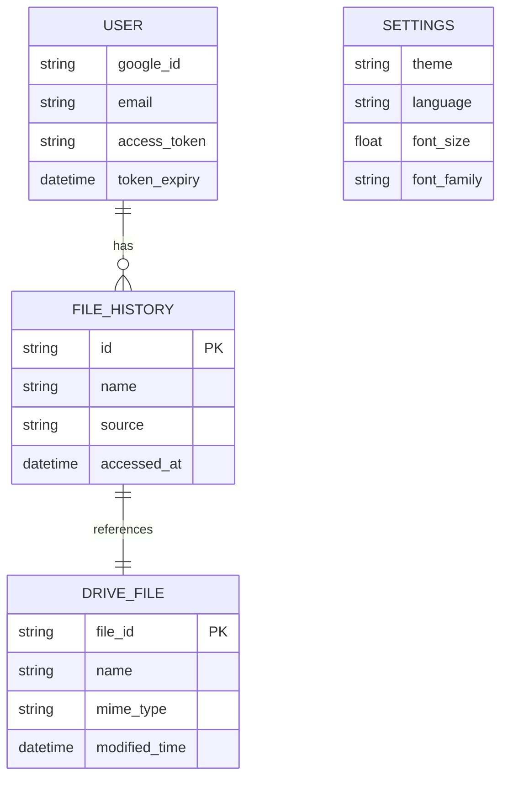
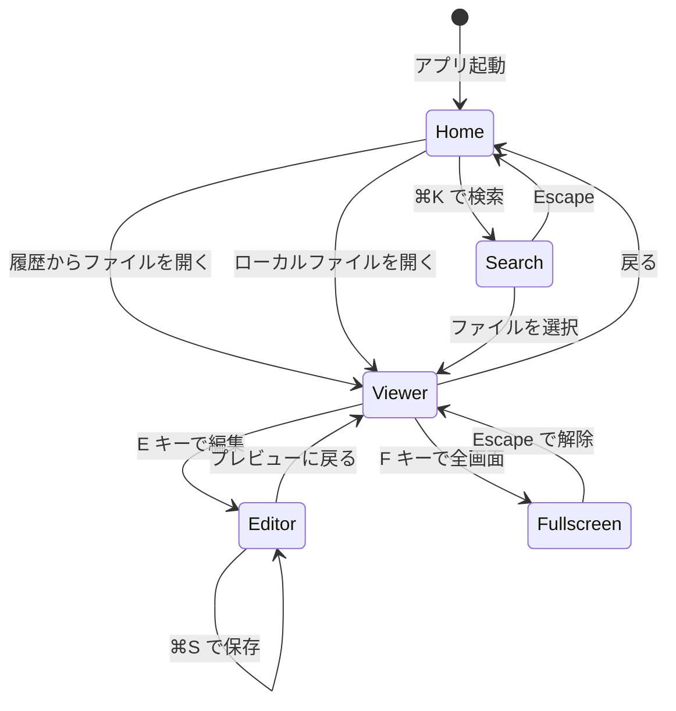
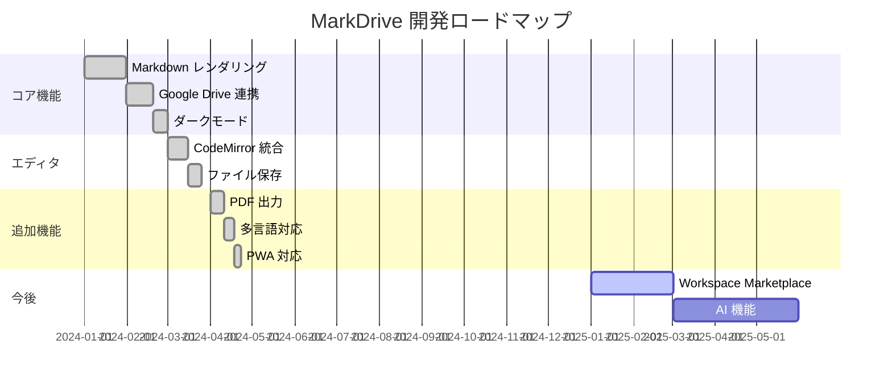
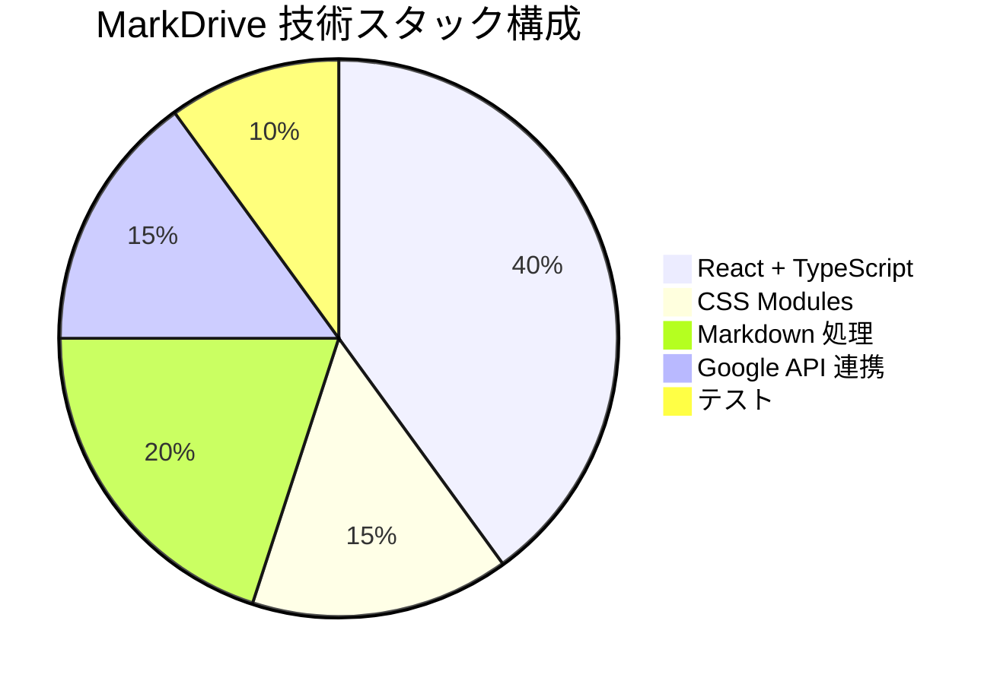
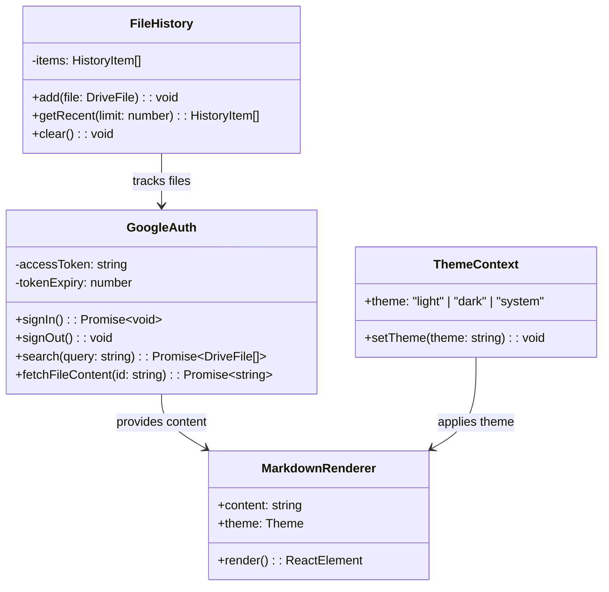

# MarkDrive サンプルドキュメント

MarkDrive の全機能を体験するためのサンプルファイルです。このファイルを Google Drive にアップロードするか、ローカルファイルとして開いてください。

---

## 基本的な Markdown

### テキスト装飾

これは **太字** のテキストです。これは *イタリック* です。***太字イタリック*** も使えます。

インラインの `コード` はバッククォートで囲みます。

> 引用ブロックはこのように表示されます。
> 複数行にまたがることもできます。
>
> > ネストされた引用も可能です。

---

## GFM（GitHub Flavored Markdown）

### テーブル

| 機能 | 対応状況 | 備考 |
|------|:--------:|------|
| GFM テーブル | ✅ | 左寄せ・中央・右寄せ対応 |
| タスクリスト | ✅ | チェックボックス表示 |
| シンタックスハイライト | ✅ | 多数の言語に対応 |
| Mermaid | ✅ | ダイアグラム描画 |
| KaTeX 数式 | ✅ | インライン・ブロック対応 |
| PDF 出力 | ✅ | A4 サイズ |

### タスクリスト

- [x] MarkDrive にアクセスする
- [x] Google アカウントでサインインする
- [x] サンプルファイルを開く
- [ ] ダークモードを試す
- [ ] PDF 出力を試す
- [ ] 編集モードを試す

### 打ち消し線

~~この機能は廃止されました~~ → 新しい API に移行済み

### オートリンク

https://mark-drive.com/

---

## シンタックスハイライト

### JavaScript

```javascript
async function fetchMarkdown(fileId) {
  const response = await fetch(
    `https://www.googleapis.com/drive/v3/files/${fileId}?alt=media`,
    { headers: { Authorization: `Bearer ${token}` } }
  );
  const text = await response.text();
  return text;
}
```

### TypeScript

```typescript
interface FileHistory {
  id: string;
  name: string;
  source: "google-drive" | "local";
  accessedAt: Date;
}

const getRecentFiles = (limit: number = 10): FileHistory[] => {
  const raw = localStorage.getItem("markdrive-file-history");
  if (!raw) return [];
  return JSON.parse(raw).slice(0, limit);
};
```

### Python

```python
def fibonacci(n: int) -> list[int]:
    """フィボナッチ数列を生成する"""
    if n <= 0:
        return []
    sequence = [0, 1]
    while len(sequence) < n:
        sequence.append(sequence[-1] + sequence[-2])
    return sequence[:n]

print(fibonacci(10))
# [0, 1, 1, 2, 3, 5, 8, 13, 21, 34]
```

### Go

```go
package main

import (
    "fmt"
    "net/http"
)

func handler(w http.ResponseWriter, r *http.Request) {
    fmt.Fprintf(w, "Hello, MarkDrive!")
}

func main() {
    http.HandleFunc("/", handler)
    http.ListenAndServe(":8080", nil)
}
```

### Rust

```rust
fn main() {
    let languages = vec!["Rust", "Go", "TypeScript", "Python"];
    
    let result: Vec<String> = languages
        .iter()
        .filter(|lang| lang.len() > 3)
        .map(|lang| format!("{} is great!", lang))
        .collect();
    
    for msg in &result {
        println!("{}", msg);
    }
}
```

### HTML / CSS

```html
<div class="markdown-body" data-theme="dark">
  <h1>MarkDrive</h1>
  <p>Beautiful Markdown for Google Drive</p>
</div>
```

```css
.markdown-body {
  --accent: #6366f1;
  font-family: -apple-system, BlinkMacSystemFont, "Segoe UI", sans-serif;
  line-height: 1.6;
  max-width: 800px;
  margin: 0 auto;
}

.markdown-body[data-theme="dark"] {
  background: #1a1a2e;
  color: #e0e0e0;
}
```

### JSON

```json
{
  "name": "mark-drive",
  "version": "1.0.0",
  "description": "Beautiful Markdown viewer for Google Drive",
  "scripts": {
    "dev": "vite",
    "build": "tsc && vite build",
    "preview": "vite preview"
  }
}
```

### YAML

```yaml
name: Deploy to Vercel
on:
  push:
    branches: [main]
jobs:
  deploy:
    runs-on: ubuntu-latest
    steps:
      - uses: actions/checkout@v4
      - uses: oven-sh/setup-bun@v2
      - run: bun install
      - run: bun run build
```

### Shell

```bash
#!/bin/bash
echo "Setting up MarkDrive..."
git clone https://github.com/luckypool/mark-drive.git
cd mark-drive
bun install
cp .env.example .env
echo "Edit .env with your Google API keys"
bun run dev
```

### SQL

```sql
SELECT
    files.name,
    files.mime_type,
    files.modified_time,
    owners.email AS owner
FROM drive_files AS files
JOIN file_owners AS owners ON files.id = owners.file_id
WHERE files.mime_type = 'text/markdown'
ORDER BY files.modified_time DESC
LIMIT 20;
```

---

## Mermaid ダイアグラム

### フローチャート



### シーケンス図



### ER 図



### 状態遷移図



### ガントチャート



### パイチャート



### クラス図



---

## 数式（KaTeX）

### インライン数式

アインシュタインの有名な式 $E = mc^2$ は、質量とエネルギーの等価性を表しています。円の面積は $A = \pi r^2$ で求められ、二次方程式の解の公式は $x = \frac{-b \pm \sqrt{b^2 - 4ac}}{2a}$ です。

### ブロック数式

ガウス積分:

$$
\int_{-\infty}^{\infty} e^{-x^2} \, dx = \sqrt{\pi}
$$

総和公式:

$$
\sum_{i=1}^{n} i = \frac{n(n+1)}{2}
$$

オイラーの等式:

$$
e^{i\pi} + 1 = 0
$$

テイラー展開:

$$
f(x) = \sum_{n=0}^{\infty} \frac{f^{(n)}(a)}{n!}(x - a)^n
$$

行列:

$$
A = \begin{pmatrix} a_{11} & a_{12} & \cdots & a_{1n} \\ a_{21} & a_{22} & \cdots & a_{2n} \\ \vdots & \vdots & \ddots & \vdots \\ a_{m1} & a_{m2} & \cdots & a_{mn} \end{pmatrix}
$$

ナビエ–ストークス方程式:

$$
\frac{\partial \mathbf{u}}{\partial t} + (\mathbf{u} \cdot \nabla)\mathbf{u} = -\frac{1}{\rho}\nabla p + \nu \nabla^2 \mathbf{u} + \mathbf{f}
$$

---

## その他の Markdown 要素

### リンク

- [MarkDrive 公式サイト](https://mark-drive.com/)
- [GitHub リポジトリ](https://github.com/luckypool/mark-drive)

### 画像（プレースホルダー）

画像は Markdown 標準の構文で表示されます:

```markdown

```

### 水平線

上下のセクションを区切る水平線:

---

### リスト

#### 順序なしリスト

- MarkDrive の特徴
  - プライバシーファースト
    - サーバーレス設計
    - ファイル内容はブラウザ内で処理
  - 美しいレンダリング
    - シンタックスハイライト
    - Mermaid ダイアグラム
  - Google Drive との統合

#### 順序ありリスト

1. Google Drive にサインイン
2. Markdown ファイルを検索
3. ファイルを選択してプレビュー
4. 必要に応じて編集
5. PDF として出力・共有

### 脚注風の補足

テキスト中の補足情報は、引用ブロックを使って表現できます:

> **💡 Tip:** `⌘K`（Mac）または `Ctrl+K`（Windows）でどこからでも検索画面を開けます。

> **⚠️ Note:** Google Drive ファイルの編集内容は Drive に書き戻されません。ダウンロードとして保存されます。

---

## 長文テキストのレンダリング確認

MarkDrive はプライバシーを最優先に設計された Markdown ビューアです。Google Drive に保存された `.md` ファイルをブラウザ上で美しくレンダリングし、シンタックスハイライトや Mermaid ダイアグラムなど、技術ドキュメントに必要な機能をすべてサポートしています。ファイル内容は Google Drive からブラウザに直接送信され、中間サーバーは一切介在しません。これにより、機密情報を含むドキュメントも安心して閲覧できます。

CodeMirror 6 を搭載した編集モードでは、Markdown シンタックスハイライト、行番号表示、エディタ内検索などの機能を提供します。ローカルファイルは File System Access API 対応ブラウザで直接上書き保存が可能です。ダークモード・ライトモード・システム追従の 3 つのテーマモード、日本語・英語の多言語対応、フォントサイズ・書体のカスタマイズなど、快適な閲覧体験を提供します。

---

*このサンプルドキュメントは [MarkDrive](https://mark-drive.com/) の機能確認用に作成されました。*
